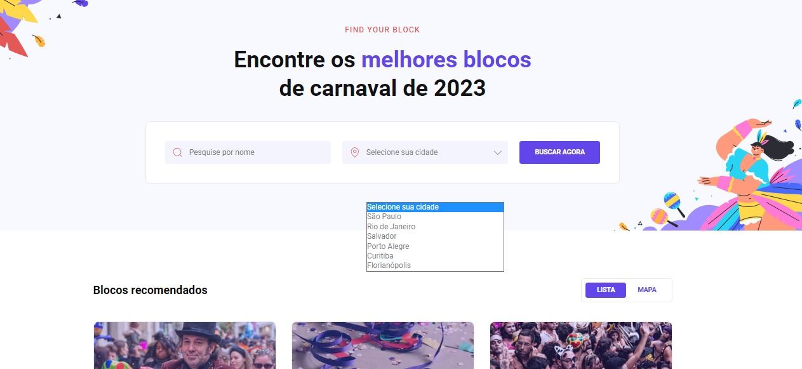

<h1 align="center"> Site para encontrar seu bloco no carnaval </h1>

#boraCodar são desafios semanais, promovido pela Rocketseat para ensino de tecnologias WEB.  

 

## 🛠 Tecnologias Utilizadas

Esse projeto foi desenvolvido com as seguintes tecnologias:

- HTML e CSS
- Git e Github
- Figma
- Phosphor Icons

**O que aprendi nesse desafio:**

- Organização de Github, readme, imagens, hacks para tabela de readme
- Input, Select e Button customizados
- Uso de ícones e fontes customizdas
- HTML: `form`,`header`,`main`,`section`,`form`,`select`,`img`,
- CSS: `all`, `overflow`, `::before`, `::after`, `rem`, `position`, `fit-content`, `flex e grid`, `@media`, `responsividade`
- Novo DevTools do Edge

## 📞 Contato
beatriizangelis@gmail.com

